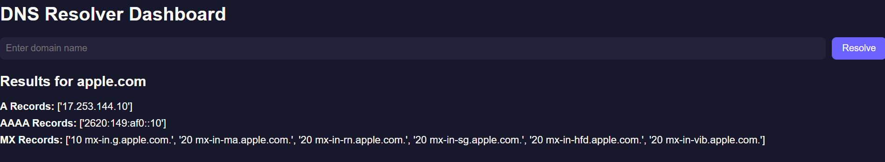
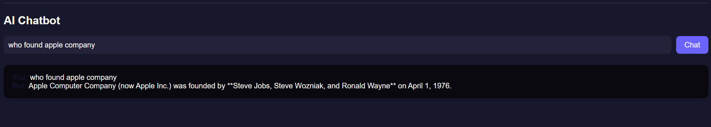

# DNS Project Dashboard

A web-based dashboard for DNS resolution and AI-powered chatbot queries, built with Flask. This project allows users to resolve DNS records and interact with an AI chatbot, with all queries logged for record-keeping.

## Features

- **DNS Resolver:** Enter a domain name to get DNS records.
- **AI Chatbot:** Ask questions and get responses from an integrated AI chatbot (Gemini AI).
- **Logging:** All DNS and chatbot queries are logged (previously to Supabase; logging can be customized).
- **Modern UI/UX:** Simple, attractive, and easy-to-use interface.

## Technologies Used

- Flask
- dnspython
- python-dotenv
- requests

## Setup Instructions

1. **Clone the repository:**
   ```sh
   git clone <your-repo-url>
   cd dns-dashboard
   ```
2. **Create and activate a virtual environment:**
   ```sh
   python -m venv venv
   venv\Scripts\activate  # On Windows
   # or
   source venv/bin/activate  # On macOS/Linux
   ```
3. **Install dependencies:**
   ```sh
   pip install -r requirements.txt
   ```
4. **Set up environment variables:**
   - Create a `.env` file in the project root with your API keys and configuration.

5. **Run the app:**
   ```sh
   python dashboard/app.py
   ```
6. **Access the dashboard:**
   - Open your browser and go to `http://localhost:5000`

## Project Structure

```
DNS project/
├── chatbot/
│   ├── __init__.py
│   └── bot.py
├── dashboard/
│   ├── app.py
│   ├── static/
│   │   └── style.css
│   └── templates/
│       └── index.html
├── resolver/
│   ├── __init__.py
│   └── resolver.py
├── requirements.txt
└── .env
```

## Screenshots

Add screenshots of the dashboard and chatbot below:

### DNS Resolver



### Chatbot



## License

This project is licensed under the MIT License.

---

*Replace the screenshot image paths with your actual screenshot files in a `screenshots/` folder.*
